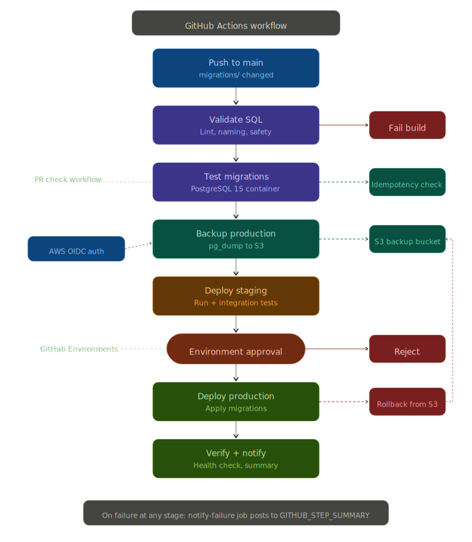

# Database CI/CD Automation Pipeline

## The Problem

Database deployments are high-risk because:

- A single bad query can break production
- Rollbacks are difficult or impossible
- Changes are often manual and error-prone

## The Solution

This pipeline introduces:

- Automated SQL validation (prevents bad queries)
- Migration testing in isolated environments
- Automated backup before deployment
- Manual approval for production releases
- Rollback capability using S3 backups

## Overview

A production-grade CI/CD pipeline for automating database schema migrations using GitHub Actions, Git-based version control, and PostgreSQL.

Every schema change is:

- validated
- tested against an ephemeral database
- deployed to staging
- approved via GitHub Environments
- applied to production

All with automatic rollback on failure.

No Jenkins server to maintain. No static AWS credentials. The pipeline uses GitHub Actions with OIDC federation to assume a short-lived IAM role, eliminating the need to store long-lived access keys as secrets.

## Architecture



## 🔄 Pipeline Flow

1. Developer pushes SQL migration
2. GitHub Actions triggers pipeline
3. SQL is validated (lint + safety checks)
4. Migrations tested in PostgreSQL container
5. Production backup created (pg_dump → S3)
6. Deploy to staging + run integration tests
7. Manual approval required
8. Deploy to production
9. Verify and notify

## ⚠️ Note on Backup Step

The backup step simulates a production-grade process and requires:

- AWS IAM role via OIDC
- S3 bucket
- Live PostgreSQL instance

In this demo project, the step may fail intentionally without real infrastructure.

## CI/CD Workflows

The pipeline consists of two workflows:
**[`database-deploy.yml`](.github/workflows/database-deploy.yml)** (main pipeline; workflow name **Database Migration Pipeline**) — On **push to `main`** (paths: `migrations/**`, `scripts/**`, or this workflow file), runs the full chain: validate → test → backup → staging → production (with **environment** approval) → verify, plus a failure notifier. On **pull requests** to `main` that only change `migrations/**`, it runs **Validate** and **Test** (ephemeral Postgres) only — no AWS backup or deploy jobs. **`workflow_dispatch`** runs the same full chain on `main` with optional `dry_run`, `skip_staging`, and `target_version`. Production failures trigger rollback from the S3 backup.

**[`pr-check.yml`](.github/workflows/pr-check.yml)** (workflow name **PR Migration Check**) — Runs on **pull requests** to `main` when `migrations/**` or `scripts/**` changes. It validates, runs migrations against a service container, checks idempotency, and can post a PR comment.

> **Note:** `skip_staging` is intended for hotfixes, but production deploy currently **`needs`** both backup and staging jobs; if staging is skipped, **deploy-production** may not run until that graph is adjusted. Prefer the default path (staging + integration tests) for production.

### CI/CD Workflow

```
Open PR (migrations/scripts) → pr-check.yml (and database-deploy validate+test if migrations)
Merge to main (push)       → database-deploy.yml full run: validate → test → backup → staging → approve → production → verify
```

### Migration Strategy

Migrations use a forward-only versioning scheme:

- Each migration is a numbered SQL file: `V1_create_tables.sql`, `V2_add_indexes.sql`
- A `schema_migrations` table tracks which versions have been applied
- The deploy script applies only pending migrations, in version order
- Each migration runs in a transaction (except `CONCURRENTLY` operations)

### Rollback Strategy

**Automatic (on failure):** If the production job fails, the rollback step downloads the backup from S3 and restores using `pg_restore --clean --if-exists`.

**Manual (targeted):** Each migration file includes a rollback header comment with the exact SQL to undo that specific migration.

### Authentication

The pipeline uses **GitHub Actions OIDC** to authenticate with AWS — no static access keys:

1. GitHub Actions requests a short-lived OIDC token from GitHub's identity provider
2. The token is exchanged for temporary AWS credentials via `sts:AssumeRoleWithWebIdentity`
3. The IAM role trust policy restricts access to this specific repository
4. Credentials expire automatically after the job completes

## Technologies Used

| Technology | Purpose |
|---|---|
| **GitHub Actions** | CI/CD orchestration, PR checks, environment approvals |
| **GitHub Environments** | Production approval gates with required reviewers |
| **PostgreSQL 15** | Target database engine (also used as service container in tests) |
| **AWS OIDC** | Keyless authentication from GitHub Actions to AWS |
| **AWS RDS** | Managed database hosting (staging + production) |
| **AWS S3** | Pre-deployment backup storage with lifecycle policies |
| **AWS SSM** | Secure credential storage for database passwords |
| **Terraform** | Infrastructure provisioning (OIDC, RDS, S3, IAM) |
| **Bash** | Migration deployment script |

## Infrastructure Setup

### Prerequisites

- AWS account (Terraform creates a **VPC**, two **private subnets** in different AZs, then RDS, S3, IAM, etc.)
- GitHub repository (public or private)
- Terraform >= 1.5 for infrastructure provisioning
- PostgreSQL client tools on the runner (installed automatically in workflows)

### Step 1: Provision Infrastructure with Terraform

**No `terraform.tfvars` file is required.** Defaults cover region, VPC CIDR, GitHub OIDC placeholders, and **randomly generated** database passwords.

```bash
cd terraform
terraform init
terraform apply
```

Optional overrides (only if you need them):

```bash
terraform apply \
  -var="aws_region=us-west-2" \
  -var="github_org=YOUR_ORG" \
  -var="github_repo=YOUR_REPO_NAME"
```

This creates (in order): **VPC** and **two private subnets** (`network.tf`), security group and **RDS subnet group**, GitHub **OIDC** provider, **IAM** role, **staging** and **production** RDS (**`db.t4g.micro`**, small storage — intended for testing), **S3** backup bucket, and **SSM** parameters. Database passwords are created by Terraform (`random_password`); they are **not** stored in tfvars.

After apply, copy outputs into GitHub:

| Output / command | GitHub secret |
|------------------|---------------|
| `github_actions_role_arn` | `AWS_ROLE_ARN` |
| `backup_bucket` | `BACKUP_S3_BUCKET` |
| `staging_endpoint` | use as `DB_STAGING_HOST` |
| `production_endpoint` | use as `DB_PROD_HOST` |
| `terraform output -raw staging_db_password` | `DB_STAGING_PASSWORD` |
| `terraform output -raw production_db_password` | `DB_PROD_PASSWORD` |

Set **`github_org`** / **`github_repo`** to your real GitHub org and repo before relying on OIDC (defaults are `example` / `example` and will not match your workflows until updated). Re-apply after changing them.

### Step 2: Configure GitHub Secrets

Go to your repository → **Settings → Secrets and variables → Actions** and add:

| Secret | Value |
|---|---|
| `AWS_ROLE_ARN` | Same value as Terraform output `github_actions_role_arn` |
| `DB_STAGING_HOST` | Staging RDS endpoint |
| `DB_STAGING_USER` | `dbadmin` |
| `DB_STAGING_PASSWORD` | From `terraform output -raw staging_db_password` |
| `DB_STAGING_NAME` | `appdb_staging` |
| `DB_PROD_HOST` | Production RDS endpoint |
| `DB_PROD_USER` | `dbadmin` |
| `DB_PROD_PASSWORD` | From `terraform output -raw production_db_password` |
| `DB_PROD_NAME` | `appdb_production` |
| `BACKUP_S3_BUCKET` | Same value as Terraform output `backup_bucket` |

### Step 3: Configure the Production Environment

Go to **Settings → Environments → New environment** → name it `production`. Add required reviewers (your DBA team or DevOps leads). This creates the approval gate — the pipeline pauses before production deployment until a reviewer approves.

### Step 4: Network Access

GitHub-hosted runners use dynamic public IPs. For the runners to reach your private RDS instances, you have a few options: use self-hosted runners inside the VPC (recommended for production), use AWS RDS Proxy with IAM authentication, or set up a VPN/tunnel from the runner to the VPC.

## Project Structure

```
database-cicd-pipeline/
├── .github/
│   └── workflows/
│       ├── database-deploy.yml   # Main pipeline: validate → test → deploy
│       └── pr-check.yml          # PR validation: test + comment on PR
│
├── migrations/
│   ├── V1_create_tables.sql      # Core schema: users, products, orders
│   ├── V2_add_indexes.sql        # Performance indexes (CONCURRENTLY)
│   └── V3_add_audit_log.sql      # Audit trail + schema enhancements
│
├── scripts/
│   └── deploy_database.sh        # Migration runner: discover, validate, apply, track
│
├── architecture/
│   └── github_actions_cicd_pipeline_flow.svg
│
├── terraform/
│   └── infra.tf                  # OIDC, RDS, S3, IAM infrastructure
│
└── README.md
```

### Migration Naming Convention

```
V<number>_<description>.sql
```

- Version number must be a positive integer (V1, V2, V10)
- Description uses lowercase with underscores: `create_tables`, `add_indexes`
- The PR check and validate jobs enforce this naming — misnaming fails the build

## Deployment Steps

### 1. Write a New Migration

```sql
-- migrations/V4_add_user_preferences.sql
BEGIN;

ALTER TABLE users ADD COLUMN preferences JSONB DEFAULT '{}';
CREATE INDEX idx_users_preferences ON users USING GIN (preferences);

INSERT INTO schema_migrations (version, description)
VALUES ('V4', 'Add preferences JSONB column to users');

COMMIT;
```

### 2. Open a Pull Request

```bash
git checkout -b feature/user-preferences
git add migrations/V4_add_user_preferences.sql
git commit -m "V4: Add user preferences column"
git push origin feature/user-preferences
```

The **`pr-check.yml`** workflow runs automatically for changes under `migrations/**` or `scripts/**`. **`database-deploy.yml`** also runs on the PR when **`migrations/**`** changes (Validate + Test only; no AWS deploy). A PR that only changes `scripts/` will not trigger **`database-deploy.yml`**, but **`pr-check.yml`** still runs if `scripts/**` is in the diff.

### 3. Merge to Main

After review and PR check passes, merge to `main`. The `database-deploy.yml` pipeline triggers automatically.

### 4. Approve the Production Deployment

After staging passes, the pipeline pauses at the `deploy-production` job because it references the `production` environment. A designated reviewer approves in the GitHub Actions UI.

### 5. Monitor the Result

The verify job posts a `GITHUB_STEP_SUMMARY` with deployment details. Check the Actions tab for full logs.

### Manual Trigger

**Actions → Database Migration Pipeline → Run workflow** on **`main`**. **`dry_run: true`** runs **Validate** and **Test** only (skips backup, staging, production, verify). **`target_version`** (e.g. `V3`) limits applied migrations. **`skip_staging`** — see the [note above](#architecture) about production `needs` staging.

## Testing

### Local Testing with Docker

```bash
# Start PostgreSQL
docker run -d --name testdb \
  -e POSTGRES_USER=dbadmin \
  -e POSTGRES_PASSWORD=testpass \
  -e POSTGRES_DB=appdb \
  -p 5432:5432 \
  postgres:15

# Run all migrations
./scripts/deploy_database.sh \
  --host localhost --port 5432 \
  --user dbadmin --password testpass \
  --database appdb --migrations-dir ./migrations

# Dry run
./scripts/deploy_database.sh \
  --host localhost --port 5432 \
  --user dbadmin --password testpass \
  --database appdb --migrations-dir ./migrations \
  --dry-run
```

### Verify Schema

```sql
SELECT version, description, applied_at, execution_time
FROM schema_migrations ORDER BY version;

SELECT table_name FROM information_schema.tables
WHERE table_schema = 'public' ORDER BY table_name;
```

## Monitoring

### Workflow Metrics

GitHub Actions provides built-in metrics in the Actions tab. Key things to track: workflow duration (the test job should complete in under 2 minutes), failure rate by job (frequent validation failures suggest the team needs SQL review guidelines), and approval latency (how long the pipeline waits at the environment gate).

### Post-Deploy Health Checks

The verify job runs these automatically, but you can also run them manually:

```bash
# Active connections
psql -c "SELECT count(*) FROM pg_stat_activity WHERE datname = 'appdb_production';"

# Long-running queries
psql -c "SELECT pid, now() - query_start AS duration, query
         FROM pg_stat_activity
         WHERE state != 'idle' AND query_start < now() - interval '5 minutes';"

# Table sizes
psql -c "SELECT relname, pg_size_pretty(pg_total_relation_size(relid))
         FROM pg_catalog.pg_statio_user_tables
         ORDER BY pg_total_relation_size(relid) DESC;"
```

## 🚀 Future Improvements

- **Adopt Flyway or Liquibase**  
  Replace the custom deployment script with an industry-standard tool to support checksum validation, version tracking, and safer migration workflows.

- **Self-Hosted GitHub Runners in VPC**  
  Run CI/CD jobs inside the VPC to allow secure, direct access to RDS without exposing endpoints or using tunneling.

- **Schema Diff in Pull Requests**  
  Integrate tools like `migra` to automatically generate schema diffs, giving reviewers visibility into the exact database changes before approval.

- **Blue/Green Database Deployments**  
  Implement shadow database deployments to enable zero-downtime migrations, especially for large or high-traffic tables.

- **Enhanced Notifications (Slack/Teams)**  
  Enable real-time alerts for success, failure, and approvals using webhook integrations.

- **Matrix Testing Across PostgreSQL Versions**  
  Validate migrations against multiple PostgreSQL versions (e.g., 14, 15, 16) to ensure compatibility across environments.

- **Secrets Management with Rotation**  
  Replace static credentials with AWS Secrets Manager and enable automatic rotation for improved security posture.

## 📘 Lessons Learned

- Fail-fast design is critical. If backup or validation steps fail, deployments must stop to prevent data loss  
- Database changes carry higher risk than application code and require stronger safeguards and validation  
- Breaking the pipeline into stages (validate, test, backup, deploy) improves reliability and troubleshooting  
- External dependencies such as AWS services and database connectivity must be clearly defined or mocked in non-production environments  
- Designing for failure (notifications, rollback readiness) is as important as designing for success  
